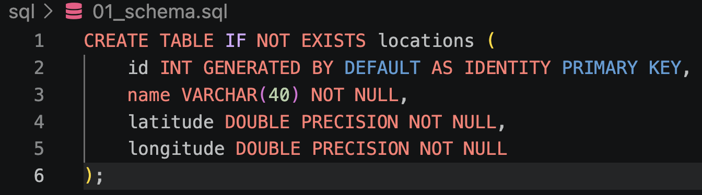
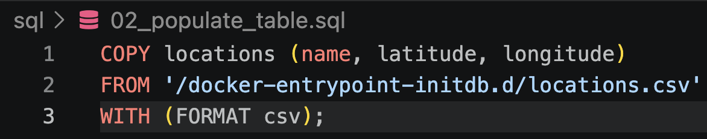
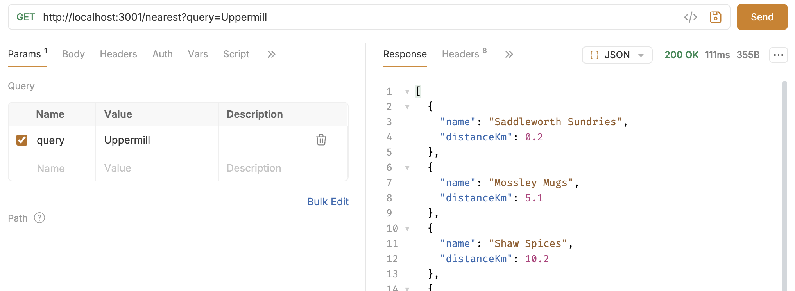
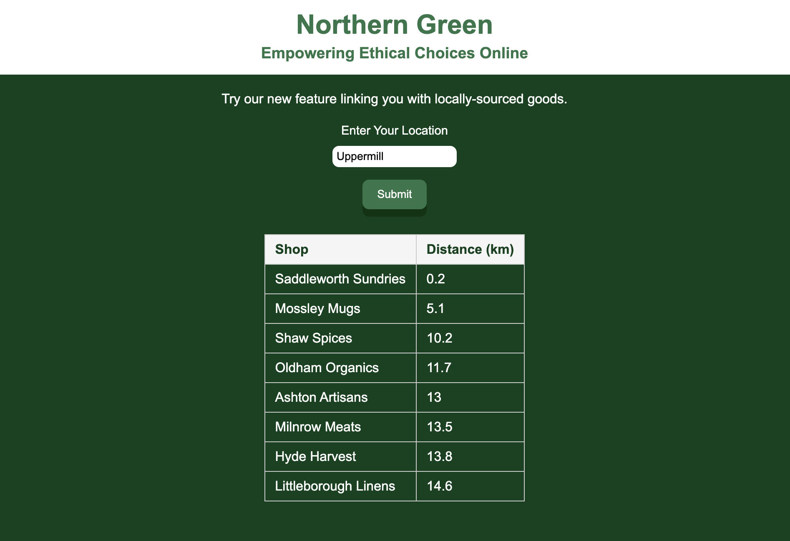

## Meeting the Assessment Requirements

#### Following through on a use case identified for Northern Green

The use case:  
"As a customer,  
I want a search tool that accounts for location,  
So that I can find goods that were sourced near me."

I created a simple application which retrieves data about shops from a database, and then transforms the data to link the customer with local goods, and displays it on a frontend.

#### 1. Populate a Postgres database to support the use case

I used Google Gemini to create a CSV of mock data in order to populate the database - I requested 50 fake shop names around Greater Manchester and their coordinates, and another 50 across the North of England.

I then created a Postgres database using a Docker image, SQL scripts to create a 'locations' table and copy over the data from CSV.





#### 2. Adapt an endpoint to the database

I created a '/nearest' endpoint with Express.js. 

How it works:
- It takes a user location input through a query parameter and turns it into coordinates using a free geocoding API
- It retrieves the data from the table with a `SELECT * FROM locations` query
- It uses Pythagoras' theorem to calculate the distances between the user and each shop in the database, and returns the 8 nearest in the response



#### 3. Editing the frontend to suit Northern Green

I made a simple frontend with React to get some practice before using it in a project at work.

It calls the '/nearest' endpoint and displays the data in a table.



## Running the App Locally

Requirements:
- Node.js
- Docker Desktop*

    *Make sure Docker Desktop is running with no active containers before running the app

Clone the repo:
```
https://github.com/tombracey/Northern-Green-Database-Assessment/tree/main
```

Mac/Linux:
```
chmod +x run_app.sh
./run_app.sh
```

Windows:  
```
run_app.bat
```
or `./run_app.bat` if using Git Bash